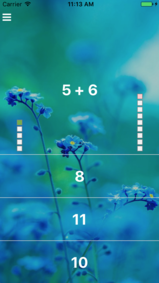
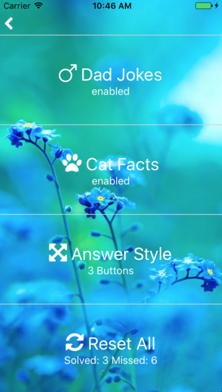

# mathhelper (version beta2.0)
A mobile app for teaching kids simple math (arithmetic)

# Idea
Every solved problem -> plus a point. Solve 10, get a reward (Dad Joke or a Cat Fact).
- Dad jokes from the cool people of: https://icanhazdadjoke.com/
- Cat Facts from the awesome people of: http://catfacts-api.appspot.com/

## Screenshots
  
 

### Background Image
Free image from [Pixabay](https://cdn.pixabay.com/photo/2017/05/11/18/20/cool-2304975_960_720.jpg)

## Tech
React-Native & Redux

# Install
To install on your device, follow these steps (hightly untested!)

## IOS
From a mac, download the code from git.  
`git clone https://github.com/themadrussian/mathhelper.git`  

Make sure you have Xcode installed.  

`npm install -g ios-deploy`  
`react-native run-ios --device "Mark's iPhone" --configuration Release`  

# TODO
My current list of ideas to develop this app further:

0. Make a new name. Cooler. Better.
1. Create more arithmetic operations (subtract, multiply, divide)
2. Think about reward logic. Every 10th correct answer?
3. Enable Black-n-White mode (turn off the image)
4. Add "share on": twitter, facebook, etc for the rewards
5. Add "About" page
6. ML for advancing the levels
7. Login
8. Multi user play
9. Auto email/notify the parent of a completed levels

# Changelog

## beta1.0 (start tracking changes)
- Cleaned up the code
- Dad Jokes and Cat Facts can be turned on and off
- Two Answers methods: 3 buttons (default), Manual keyboard

# License
MIT. Use as you like.
